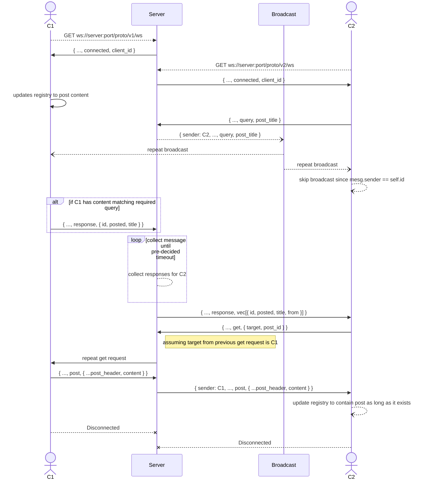

# Decentralization of Data Storage

## The Goal

Data storage in social networking applications can be quite costly,
and relying on true peer to peer networking models can be slow, part
of the reasong being that most peer to peer solutions tend to rely
on *UDP*, which is great for realtime communications, but when it
comes to reliable data propagation, fails miserably. Also a true
peer to peer network results in a complex and tedious amount of work
to find the appropriate path for data propagation. We provide a
partial peer to peer implementation to reduce the time required to
find such paths, and allow servers to store data on clients device,
reducing any form of redundancy and maintaining a data storage that
is cheap.

## The Idea

